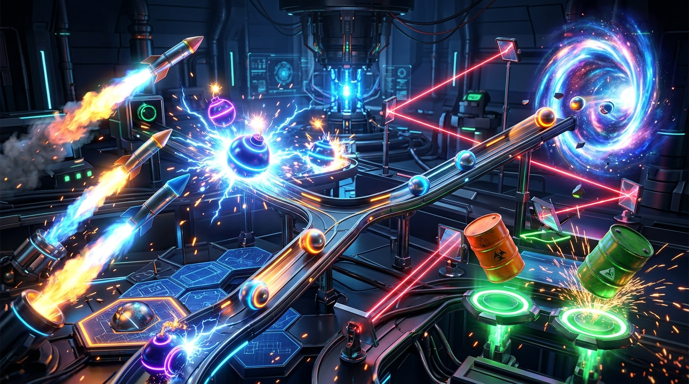
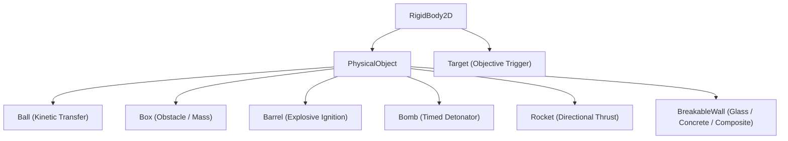

# CHAOS LAB

<div align="center">



**Build it. Trigger it. Cause chaos.**

[](https://godotengine.org/)
[-success)](licenses/ASSET_MANIFEST.csv)
[%20%7C%20Android-blue)](#platforms)
[](CHANGELOG.md)

*A premium cross-platform physics experiment puzzle game built with Godot 4.x.*

</div>

---

## Overview

**Chaos Lab** is a high-octane hybrid-casual physics puzzle game where players engineer chain reactions in a high-tech laboratory arena. Combine explosive barrels, kinetic cue balls, bounce pads, rockets, and multi-tier destructible barriers to obliterate target arrays and unleash spectacular physics chain reactions.

**The Core Loop:**
$$\text{Observe} \longrightarrow \text{Plan} \longrightarrow \text{Place} \longrightarrow \mathbf{GO} \longrightarrow \text{Chain Reaction} \longrightarrow \text{Score} \longrightarrow \text{Next}$$

---

## Key Features

- 💥 **Dynamic Chain Reaction Physics**: High-performance 2D rigid-body simulation with combo multipliers, explosive impulse propagation, and dynamic target tracking.
- 🧱 **Destructible Barriers (`BreakableWall`)**: Multi-tiered fracture system featuring Glass, Reinforced Concrete, and Composite barriers with realistic structural cracking and physics shard debris.
- ⏱️ **Bullet-Time Slow Motion**: Cinematic time dilation triggers when massive chain reactions detonate, paired with chromatic screen vignettes and shockwave shake.
- ⚡ **Quantum Boot Sequence**: Cyberpunk Quantum Reactor loading screen with real-time asset boot diagnostics, particle rings, and seamless iris screen transitions.
- 🎨 **Juicy UI Micro-Animations**: Spring-physics tweens on all menus, buttons, modal dialogues, level cards, and victory screens.
- 🔊 **Hybrid Audio Engine**: Dual-engine design featuring authentic Kenney CC0 audio streams with instantaneous procedural audio synthesis fallback.
- 🧪 **Game Modes**:
  - **Campaign Mode**: 100 hand-crafted puzzle experiments across multiple laboratory sectors.
  - **Chaos Mode**: Endless sandbox destruction with randomized catalysts and scoring milestones.
  - **Daily Experiment**: Procedurally seeded daily challenges with unique physics modifiers and streak rewards.
- 🤖 **NIX AI Companion**: In-lab witty robotic assistant guiding tutorials, banter, and milestone commentary.
- 🏆 **Progression & Economy**: 12 commercial milestones, lab coin economy, cosmetic object skins, and VIP passes.

---

## Platforms

| Platform | Target Runtime | Status | Notes |
|----------|----------------|--------|-------|
| 🖥️ **Windows** | Desktop x86_64 release | ✅ Production Ready | Full 144Hz+ unlocked physics, custom shaders |
| 🌐 **HTML5 / Web** | WebGL 2.0 / WebAssembly | ✅ Production Ready | Exported at `build/web/`, responsive touch & mouse |
| 📱 **Android** | APK / AAB (API 24+) | ✅ Architecture Ready | Adaptive touch controls, haptic vibration integration |

---

## Quick Start

### Prerequisites
- [Godot 4.7+ (Standard 64-bit)](https://godotengine.org/download/)
- Python 3.9+ (optional, for asset validation and local web testing)

### Desktop Play
1. Clone the repository:
   ```bash
   git clone https://github.com/Shanjai110603/ChaosLab.git
   cd ChaosLab
   ```
2. Open Godot 4, click **Import**, select `project.godot`, and press **Run Project (F5)**.

### Local Web Preview
To test the pre-compiled WebGL bundle locally:
```bash
python -m http.server 8080 -d build/web
```
Then navigate to `http://localhost:8080/` in Chrome, Firefox, or Edge.

---

## Controls

| Action | Desktop (Keyboard/Mouse) | Mobile / Touch |
|--------|--------------------------|----------------|
| **Select / Drag Object** | Left Click + Drag | Tap & Drag |
| **Rotate Object** | Right Click / Scroll Wheel | Two-finger Rotate |
| **Trigger Chaos (GO)** | Spacebar | Big Red "GO" Button |
| **Reset Experiment** | `R` | Reset Icon Button |
| **Undo Placement** | `Z` / `Ctrl+Z` | Undo Icon Button |
| **Pause Game** | `Escape` | Top-Right Pause Icon |
| **Debug Overlay** | `F1` | Multi-touch corner tap |
| **Skip Level (Debug)** | `F2` | — |

---

## Project Structure

```
ChaosLab/
├── project.godot                  # Godot 4 engine project configuration
├── export_presets.cfg             # Windows, HTML5, and Android export definitions
├── scenes/                        # Scene files (.tscn)
│   ├── main/                      # LoadingScreen, Main root, TitleScreen
│   ├── gameplay/                  # Arena, GameplayUI, ObjectTray
│   ├── objects/                   # Ball, Box, Barrel, Bomb, Rocket, BreakableWall, Target
│   ├── ui/                        # LevelSelect, Shop, Settings, Daily, Transitions
│   └── vfx/                       # Particle explosions, Shards, FloatingText
├── scripts/                       # Modular GDScript 2.0 source code
│   ├── core/                      # Autoload singletons (GameManager, AudioManager, etc.)
│   ├── objects/                   # Physics rigid-body logic & health mechanics
│   ├── gameplay/                  # ChainSolver, ExperimentScore, LevelLoader
│   ├── ui/                        # Responsive UI controllers & UIAnimations
│   └── vfx/                       # SlowMotionController, CameraShake, DebrisManager
├── levels/                        # Level definitions (JSON)
│   ├── campaign/                  # 100 campaign level files
│   ├── chaos/                     # Sandbox configurations
│   └── daily/                     # Daily challenge seed tables
├── assets/                        # Visual art, audio streams, fonts
│   ├── audio/                     # Authentic Kenney CC0 SFX (.ogg)
│   ├── textures/                  # Physics item sprites, debris, and UI icons
│   └── fonts/                     # Sci-fi typography
├── licenses/                      # Compliance documentation
│   ├── ASSET_MANIFEST.csv         # Full third-party asset audit & attribution table
│   └── LICENSE_*.txt              # Upstream CC0, OFL, and MIT license texts
├── tools/                         # Automated build & compliance utilities
│   ├── download_kenney_assets.py  # Verified CC0 asset downloader
│   └── validate_licenses.py       # Automated license integrity verification
├── docs/                          # Architecture & store kit documentation
└── build/                         # Export output targets (Web, Windows, Android)
```

---

## Architecture & Systems

### Autoload Singletons

| Singleton | Class / Script | Responsibility |
|-----------|----------------|----------------|
| `GameManager` | `scripts/core/GameManager.gd` | Central game state machine (`BOOT → MENU → PLAYING → RESULT`) |
| `ScreenTransition`| `scripts/ui/ScreenTransition.gd` | High-priority CanvasLayer 100 iris & wipe transition controller |
| `UIAnimations` | `scripts/ui/UIAnimations.gd` | Unified spring-physics tween library for all visual components |
| `AudioManager` | `scripts/core/AudioManager.gd` | Hybrid audio pipeline (Kenney CC0 streams + procedural synthesizer) |
| `InputManager` | `scripts/core/InputManager.gd` | Cross-platform touch and mouse input translation |
| `SaveManager` | `scripts/core/SaveManager.gd` | Encrypted/checksum-verified JSON save system with fallback backup |
| `PlatformService` | `scripts/platform/PlatformService.gd` | Abstraction for Ads, In-App Purchases, and native share dialogs |
| `SlowMotionController`| `scripts/vfx/SlowMotionController.gd` | Smooth exponential time dilation during epic chain reactions |
| `DebrisManager` | `scripts/vfx/DebrisManager.gd` | Dynamic pool for wall shard bursts, sparks, and particle debris |
| `DailyChallengeManager` | `scripts/gameplay/DailyChallengeManager.gd` | Daily seed generation, streak progression, and daily modifiers |
| `AchievementManager` | `scripts/gameplay/AchievementManager.gd` | 12 milestone triggers with coin bounties and toast banners |
| `DebugManager` | `scripts/core/DebugManager.gd` | Real-time FPS, draw calls, memory, and physics body telemetry |

### Physical Object Hierarchy



---

## Asset Licensing & Compliance

Chaos Lab adheres strictly to commercial-use licensing standards. All third-party assets utilized in this project are verified **CC0 1.0 Universal**, **SIL Open Font License (OFL)**, or **MIT**.

- **Asset Registry**: Tracked in [`licenses/ASSET_MANIFEST.csv`](licenses/ASSET_MANIFEST.csv)
- **Automated Verification**: Run the license compliance audit tool at any time:
  ```bash
  python tools/validate_licenses.py
  ```
  *(Returns exit code 0 if all assets match permitted licenses, exist on disk, and carry valid upstream URLs).*

---

## Release & Versioning

- **Current Version**: `1.1.0`
- **Store Listing**: [`docs/store/STORE_LISTING.md`](docs/store/STORE_LISTING.md)
- **Changelog**: [`CHANGELOG.md`](CHANGELOG.md)

---

<div align="center">
Built with ❤️ using Godot Engine.
</div>
